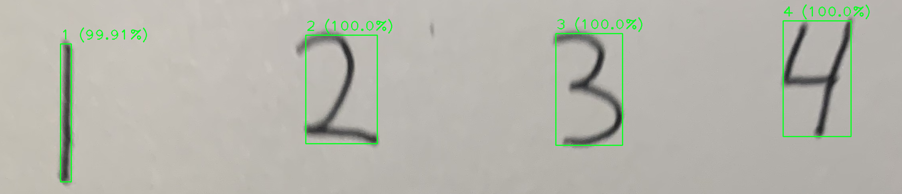

# Handwriting-Predictor
**GOAL:** predict handwriting using a convolutional neural network model.

## Description
This is one of my first major machine learning projects. A convolutional neural network model was developed using *Tensorflow* and *Keras* and trained with the [MNIST](https://www.tensorflow.org/datasets/catalog/mnist) dataset to detect handwritten digits. The model I developed recorded a **98.9% accuracy** when executing `model.evaluate` for the MNIST test images. 

My future goals with this project is to implement recognition for letters (a-z) and symbols (e.g. +-/*$#). Also, I hope to implement the model in an application that converts handwritten papers into text, distinguishing between words and spaces. 

## Libraries Used
- **Tensorflow & Keras:** used to develop the convolutional neural network model and access the MNIST dataset
- **NumPy:** used to format/prepare data that feeds into the neural network model
- **OpenCV:** used for turning user images into a format where the characters can be detected (e.g. blurring, thresholding, and contouring)
- **MatPlotLib:** used for visualizing NumPy arrays as images and predictions from the neural network model

## Updates
- March 31: able to detect & predict digits (0-9) from an image
